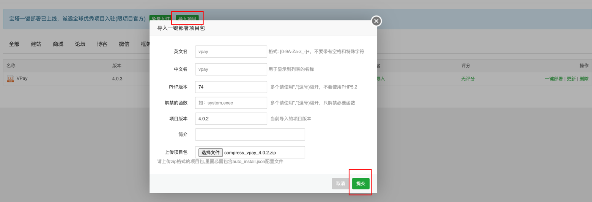
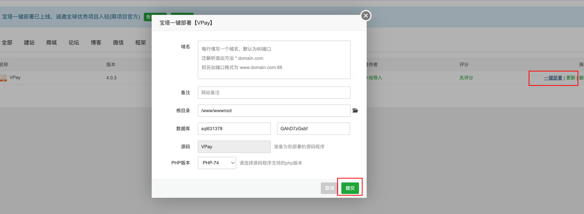
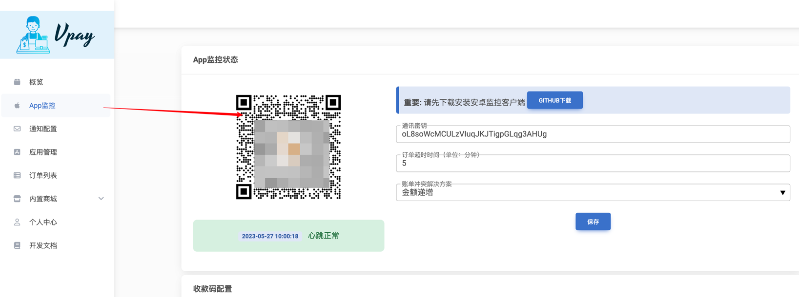
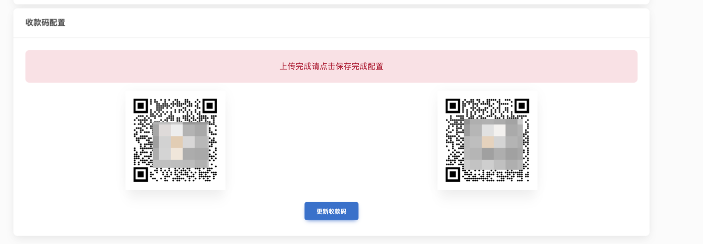
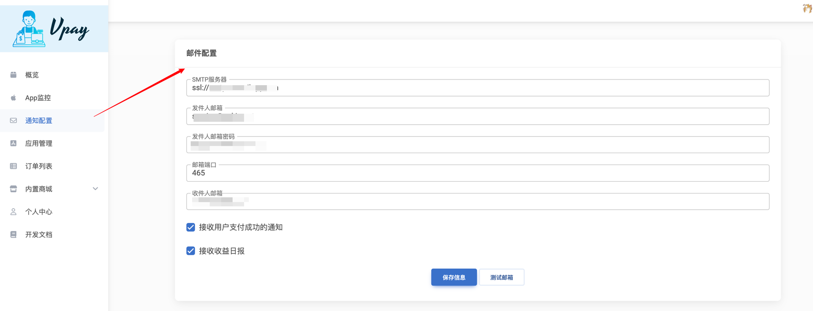

 <p align="center">

</p>


<h3 align="center">🚀 Vpay 服务端</h3>

<p align="center">
 
 
 

</p>

## 简介

Vpay ——一款个人收款解决方案，使个人开发者能够安全高效地处理在线交易。


## 安装指南

### 服务端安装
> 以下两种方案二选一
#### 一、宝塔面板一键部署

1. 导入项目到宝塔面板

2. 点击一键部署，填入域名后点提交即可


#### 二、手动部署

1. 导入项目到网站文件夹下
2. 配置运行目录为`/public`
3. 配置伪静态
```
if ( $uri ~* "^(.*)\.php$") {
rewrite ^(.*) /index.php break;
}

location / {
  try_files $uri $uri/ /index.php?$query_string;
}

```
4. 如果使用宝塔面板部署，请**务必删除**宝塔默认配置的以下配置文件
```
    location ~ .*\.(gif|jpg|jpeg|png|bmp|swf)$
    {
        expires      30d;
        error_log /dev/null;
        access_log /dev/null;
    }

    location ~ .*\.(js|css)?$
    {
        expires      12h;
        error_log /dev/null;
        access_log /dev/null;
    }
```
### 服务端配置

1. 配置App监控端，从[vpay-android](https://github.com/Vpay-Collection/vpay-android)下载安卓客户端，扫码配置：

2. 配置收款码，左侧为支付宝右侧为微信：

3. 配置邮件通知


### 接入Vpay支付

参考[vpay-sdk](https://github.com/Vpay-Collection/vpay-sdk)进行接入

## 文档

[阅读文档](https://vpay.ankio.net/)


## 开源协议

GPL V3

